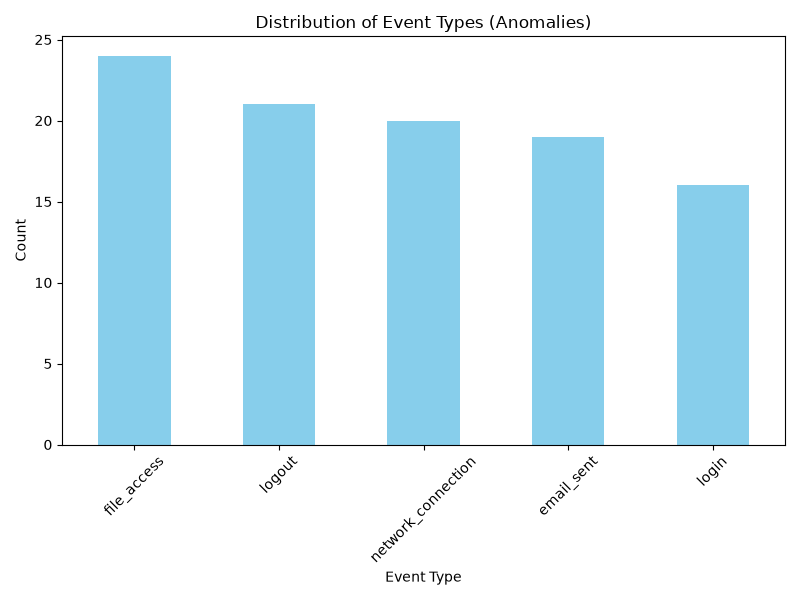

# Forensic Investigation Report

## Executive Summary
This report summarizes the findings from the digital forensic investigation. Over the course of the analysis, evidence was acquired, analyzed for anomalies, and processed for key entities to reconstruct the case narrative.

## Methodology
The investigation utilized a complete forensic workflow:
1. Data acquisition and preprocessing (`raw_evidence.csv` to `cleaned_evidence.csv`)[cite: 1].
2. Feature engineering and anomaly detection (`anomalies_detected_evidence.csv`)[cite: 1].
3. Named entity recognition on textual evidence (`extracted_entities.csv`)[cite: 1].
4. Automated reporting and visualization generation via Python and Matplotlib.

## Key Findings
- Total anomalies detected: 100
- Total extracted entities: 134
- Unique event types recorded: file_access, logout, network_connection, email_sent, login
- The event distribution chart below highlights the frequency of event types observed during the investigation timeline.

## Visualizations
